#  🙌PML__FDTD
**组员：金伟，张佳莉**

## 分工情况：
### **金伟**

- CPML部分一维和二维代码编写
- 边界吸收情况分析

### **张佳莉**

- UPML部分一维和二维代码编写
- 边界吸收情况分析。

# 🛴python、pycharm安装以及代码运行过程

## python安装

1. 进入官网：https://www.python.org/downloads/
2. 点击“*Download Python3.9.1*”

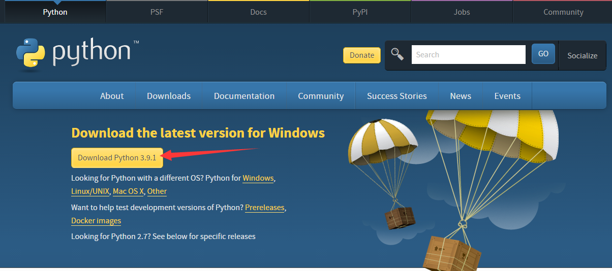

3. 下载后安装

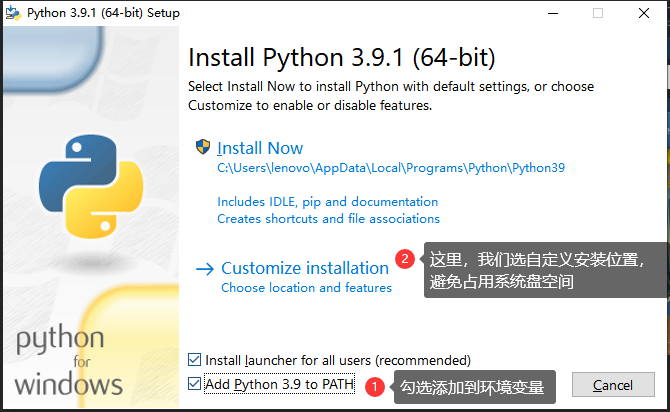

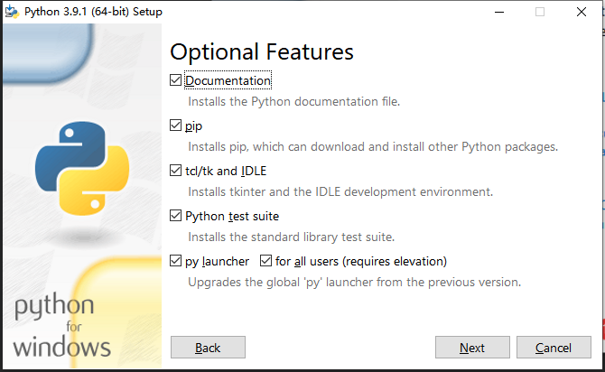

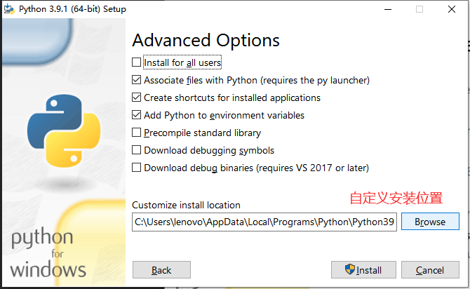

4. 点击Install，等待安装完成

   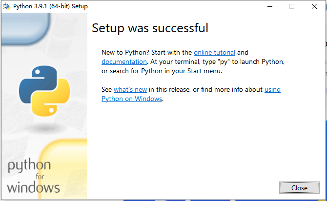

5. 接下来安装pycharm

## pycharm安装与代码运行

1. 打开官网：https://www.jetbrains.com/pycharm/download/#section=windows ，下载社区免费版。

   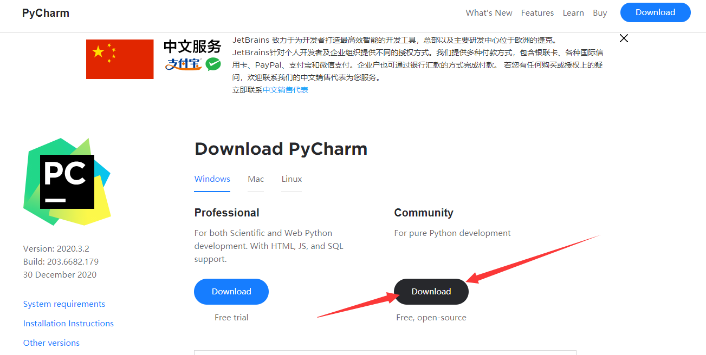

2. 自定义安装位置后，剩下的采用默认设置即可。

3. 新建项目，点击“Project Interpreter”, 选择刚刚安装好的python3.9.1

   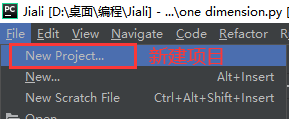

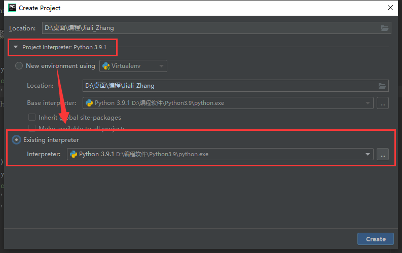

4. 安装matplotlib、numpy库，由于使用了最新的python3.9.1版本，导致默认安装的这两个库版本太新，会出错，因此我们指定安装降级的版本。

   matplotlib：3.3.1

   numpy：1.19.3

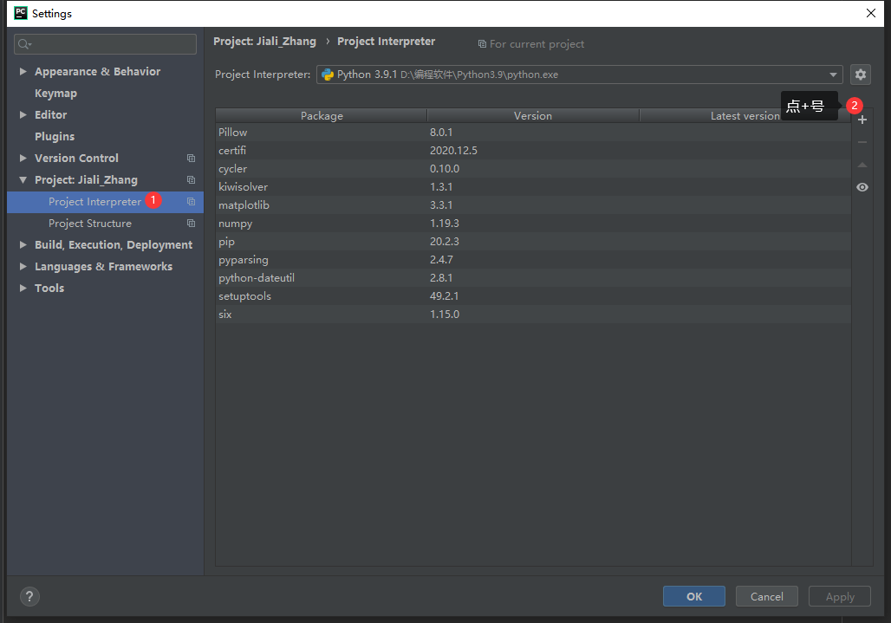

5. 然后新建一个空文件，把代码复制进去，或者不创建项目直接将代码文件拖到pycharm里面，运行即可。

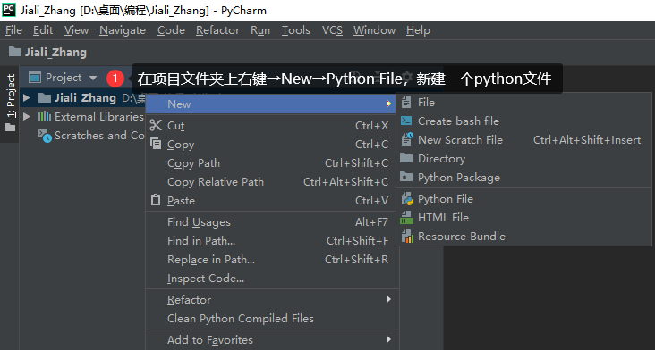

6. 然后在代码空白处，右键→Run PML1

   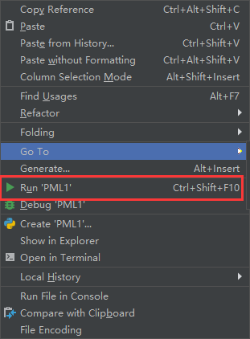

# 🎈结果分析

## 对于张佳莉的进展过程中存在的问题：

- 对于课本9.67公式存在一定的问题，在后面推导的过程中认为公式后两项在应该有负号；
- 其次最后一项的存在会导致较强反射。我们又考虑到Hx和Hy在传播过程中差别只体现在符号问题，故改变了公式的形式。
- pandas的to_excel方法比to_csv方法慢很多，故采用to_csv方法加速文件生成。

## 一维

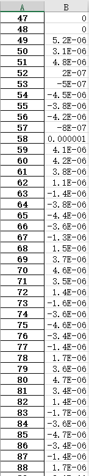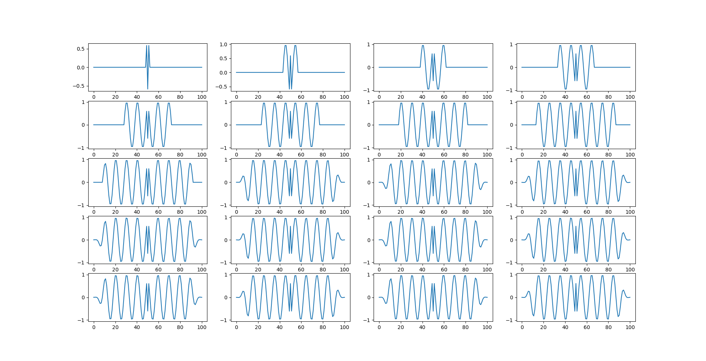

从文件夹里 one dimension1.csv可以看出，PML边界处H分量衰减到5e-6，表明吸收率很高，效果较好。右图为一维UPML吸收效果图，可以直接看到边界处几乎毫无吸收，较为理想。

## 二维

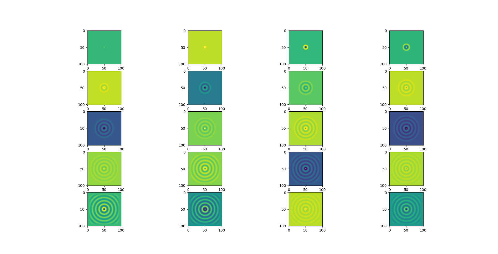

图三为二维UPML，点源在（50，50）位置处的波传播和吸收情况。边界处吸收良好，几乎不反射。在two_dimension.py中会生成一系列展现波传播过程的图。

